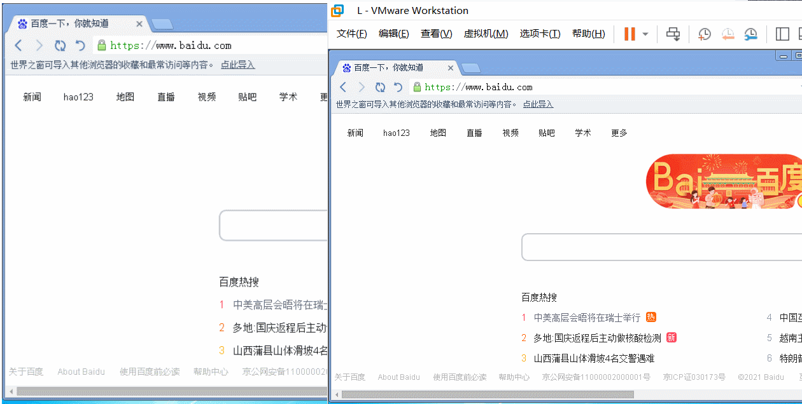

# Client-management-system
一个简单客户端管理系统，类似电子教室管理软件，教师端和学生端均使用Golang编写，用Redis数据库储存信息。

# 功能
### 学生端
- 使用账号密码登入登出
- 在聊天室中畅所欲言
- 与其他在线学生或老师发送私聊消息
- 向老师发出提问
- 提交老师布置的作业并查询自己的得分
- 作业可以提交文件了
- 检测屏幕内容 长时间未操作自动上报

### 教师端
- 添加课程 导入学生信息
- 处理学生登入、登出并立即显示
- 查询每次上课的数据
- 查看学生的到课时间
- 手动修改学生到课情况
- 显示学生提问信息
- 与学生一起在聊天室中畅聊
- 发布作业并收集学生的答案 支持文件题
- 给学生的作业打分 客观题自动评分
- 查看学生屏幕截图
- 查看学生屏幕视频1

1：由于我能力有限暂时没搞明白视频推流，这里查看学生屏幕视频实现的方法是多张连续截图，效率很低，效果如下图（左边是教师端看到的画面，右边是学生端）

# 使用说明
- 下载源码并编译学生端和教师端，数据库IP端口等信息可在config.go中修改
- 在tool文件夹中提供了快速测试100个学生端连接的方法

# 现存bug
- 高并发如多个学生端同时登录可能会导致教师端与数据库的连接断开 正在寻找解决办法

# 未来计划
- 添加黑名单程序、网站并禁止访问的功能
- 整个GUI